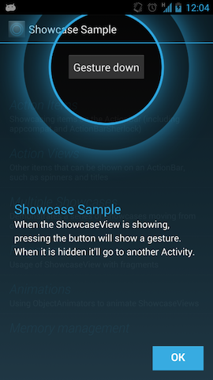
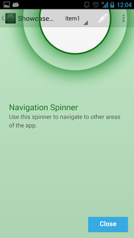

ShowcaseView library
====
  
The ShowcaseView library is designed to highlight and showcase specific parts of apps to the user with a distinctive and attractive overlay. This library is great for pointing out points of interest for users, gestures, or obscure but useful items.

The library is based on the "Cling" view found in the Launcher on Ice-Cream Sandwich and Jelly Bean, but extended to be easier to use.

Please check out [the website](http://espiandev.github.com/ShowcaseView) for more information.

Set-up
----

Ant:
Importing the library should work without any issues - but make sure the libraries in /library/libs are imported. To use the sample download [ActionBarSherlock](http://actionbarsherlock.com/usage.html) and add it as a dependency to the library project. Use point 1 on the "Including in your project" instructions at the link.

Android Studio:
Import using the build.gradle file in the top-most folder, making sure to use the Gradle wrapper. You _may_ be able to import the library by itself but this isn't officially supported. If you'd like to add the library to your project, copy the library folder into your Gradle project folder and follow the instructions on the [Android tools](http://tools.android.com/tech-docs/new-build-system/user-guide#TOC-Multi-project-setup) website.

**WARNING:** Sometimes Eclipse/IDEA will automatically import the non-NineOldAndroid versions of the animation classes, which will cause crashes on versions of Android below 3.0. Check that your imports start with `com.nineoldandroids.animation` and not `android.animation`.

The full dependency list for ShowcaseView is as follows:
- library requires android-support-v4 and nineoldandroids
- library tests require mockito and robolectric
- sample app requires ActionBarSherlock

Usage
----

To use ShowcaseView, use one of the `insertShowcaseView(..)` calls. These take:

- A [`Target`](https://github.com/Espiandev/ShowcaseView/blob/target/library/src/com/espian/showcaseview/targets/Target.java) which represents what should be showcased. See the [wiki](https://github.com/Espiandev/ShowcaseView/wiki/Target-API) for more details.
- An `Activity`
- *Optional* title and detail strings (or resource ids) which show on the ShowcaseView
- *Optional* a [`ConfigOptions`]() which can alter the behaviour of ShowcaseView. See the wiki for more details

As an example:

~~~
View showcasedView = findViewById(R.id.view_to_showcase);
ViewTarget target = new ViewTarget(showcasedView);
ShowcaseView.insertShowcaseView(target, this, R.string.showcase_title, R.string.showcase_details);
~~~

Copyright and Licensing
----

Copyright Alex Curran ([+Alex](https://plus.google.com/110510888639261520925/posts)) © 2012. All rights reserved.

This library is distributed under an Apache 2.0 License.
